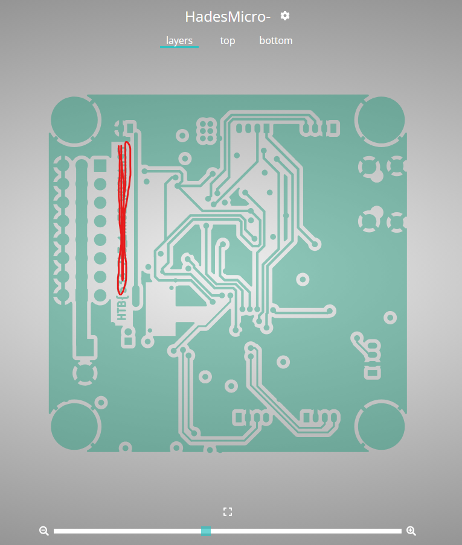
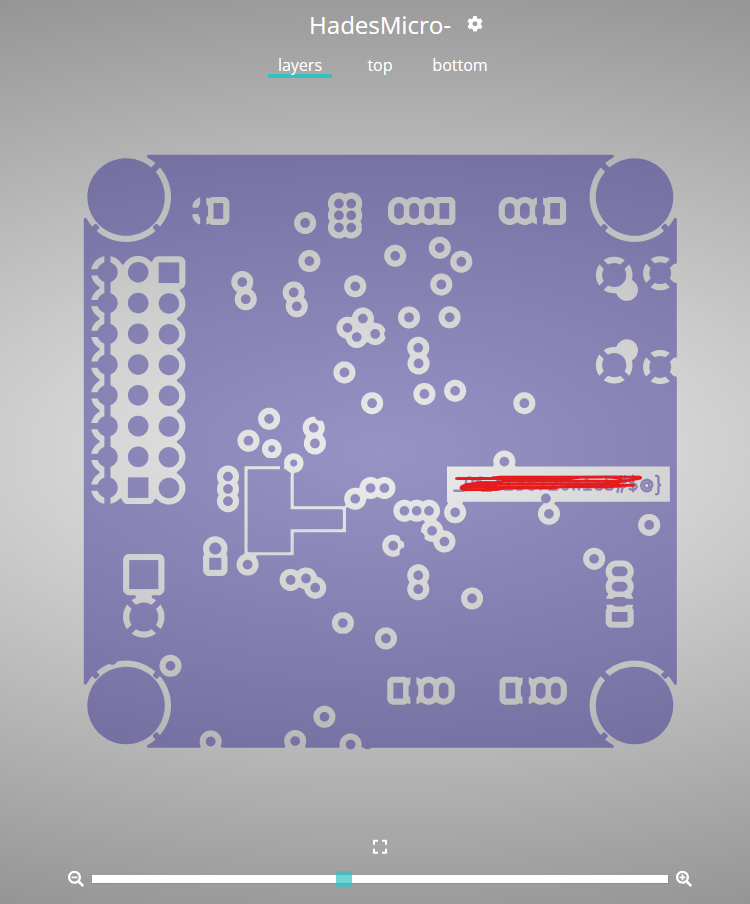

# <h1 align="center">Critical Fight CTF Challenge (PWNED - 900p)</h1>

---

Your team has assigned you to a mission to investigate the production files of Printed Circuit Boards for irregularities. This is in response to the deployment of nonfunctional DIY drones that keep falling out of the sky. The team had used a slightly modified version of an open-source flight controller in order to save time, but it appears that someone had sabotaged the design before production. Can you help identify any suspicious alterations made to the boards?

---

<h3 align="center">First key</h3>

---

  

---

<h3 align="center">Second key</h3>

---

  

